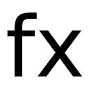
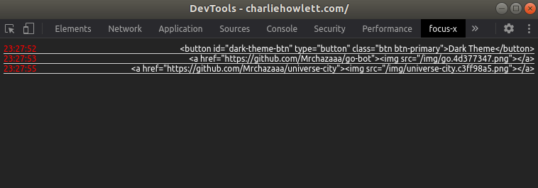

# focus-x
A simple Chrome DevTools extension to log the inspected tab's currently focused element.

https://stackoverflow.com/questions/30945681/collapse-and-expand-tree-structure-in-javascript/30945775

