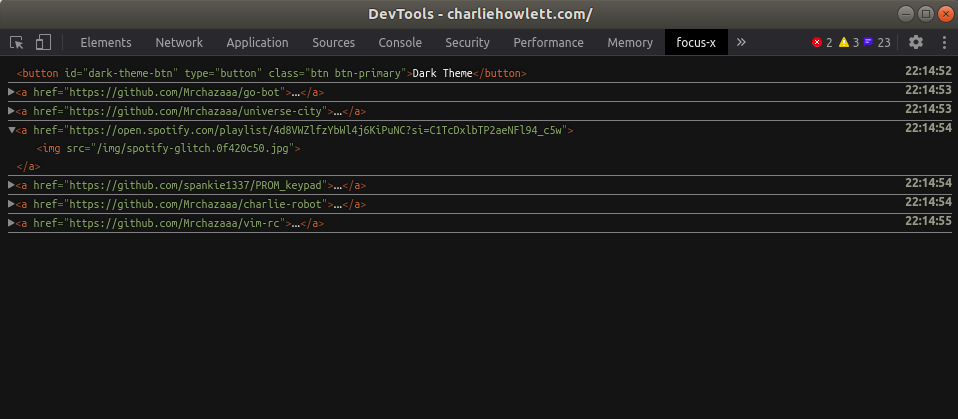

# focus-x

A Chrome DevTools extension which logs the inspected tab's currently focused element. Useful for debugging larger applications with lots of small, greedy components that keep stealing focus from eachother.

Available: https://chrome.google.com/webstore/detail/focus-x/eediabbjmjpifkdcoabkdibmofgnpghf